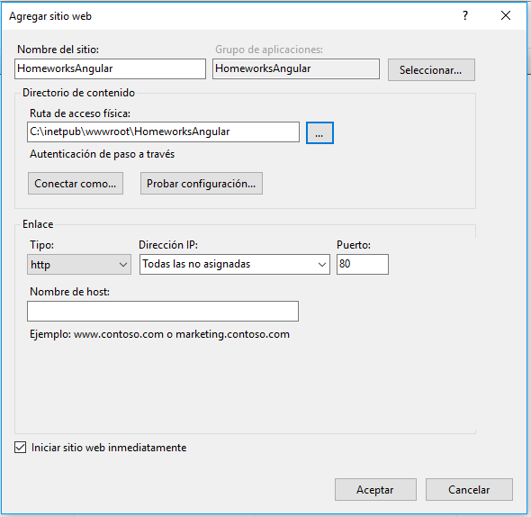
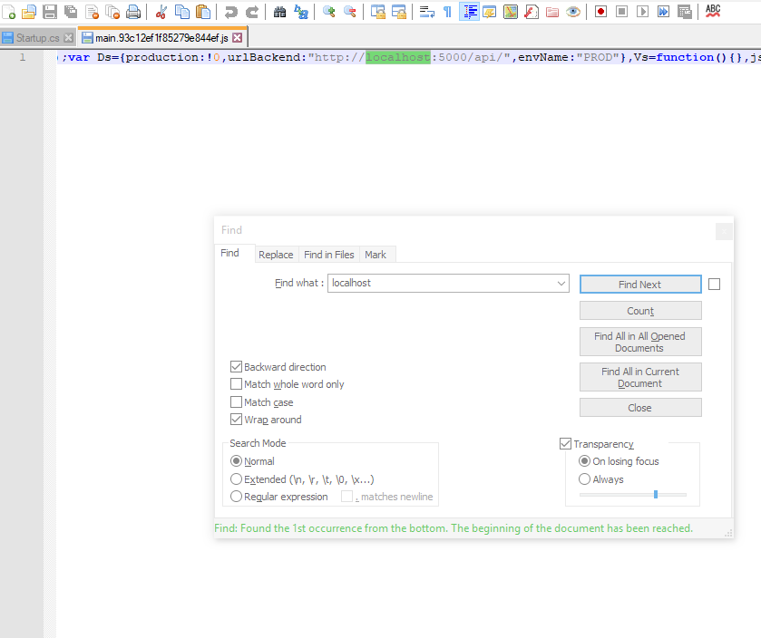

# Deployment De Angular En IIS

**Pasos para desplegar su proyecto de Angular en IIS:**

Primero vamos a activar **CORS** en nuestra WebApi para poder comunicarnos con nuestro FrontEnd

## Detalles Sobre CORS

```
El Intercambio de Recursos de Origen Cruzado (CORS) es un mecanismo que utiliza encabezados adicionales HTTP para 
permitir que un user agent obtenga permiso para acceder a recursos seleccionados desde un servidor, en un origen 
distinto (dominio), al que pertenece. Un agente crea una petición HTTP de origen cruzado cuando solicita un recurso 
desde un dominio distinto, un protocolo o un puerto diferente al del documento que lo generó.

Un ejemplo de solicitud de origen cruzado: El código JavaScript frontend de una aplicación web que se localizada 
en http://domain-a.com utiliza XMLHttpRequest para cargar el recurso http://api.domain-b.com/data.json.

Por razones de seguridad, los exploradores restringen las solicitudes HTTP de origen cruzado iniciadas dentro de un script. 
Por ejemplo, XMLHttpRequest y la API Fetch siguen la política de mismo-origen. Ésto significa que una aplicación que 
utilice esas APIs XMLHttpRequest sólo puede hacer solicitudes HTTP a su propio dominio a menos que se utilicen encabezados CORS.
```

Para habilitar **CORS** en nuestra WebApi vamos a agregar el siguiente código en nuestra clase Startup.cs:

En el nuestro método:

```C#
void ConfigureServices(IServiceCollection services)
```

```C#
services.AddCors(
    options => { options.AddPolicy(
        "CorsPolicy",
        builder => builder
            .AllowAnyOrigin()
            .AllowAnyMethod()
            .AllowAnyHeader()
            .AllowCredentials()
    );
});
```

Y luego en el metodo:

```C#
void Configure(IApplicationBuilder app, IHostingEnvironment env)
```

```C#
app.UseCors("CorsPolicy");
```

Quedando nuestra clase **Startup**:

```C#
public class Startup
{
    public Startup(IConfiguration configuration)
    {
        Configuration = configuration;
    }

    public IConfiguration Configuration { get; }

    public void ConfigureServices(IServiceCollection services)
    {
        services.AddMvc();

        services.AddDbContext<DbContext, HomeworksContext>(
            o => o.UseInMemoryDatabase("HomeworksDB")
        );
        services.AddScoped<IUserLogic, UserLogic>();
        services.AddScoped<IRepository<User>, UserRepository>();
        services.AddScoped<IHomeworkLogic, HomeworkLogic>();
        services.AddScoped<IRepository<Homework>, HomeworkRepository>();
        services.AddScoped<IExerciseLogic, ExerciseLogic>();
        services.AddScoped<IRepository<Exercise>, ExerciseRepository>();
        services.AddScoped<ISessionLogic, SessionLogic>();

        services.AddCors(
            options => { options.AddPolicy(
                "CorsPolicy",
                builder => builder
                    .AllowAnyOrigin()
                    .AllowAnyMethod()
                    .AllowAnyHeader()
                    .AllowCredentials()
            );
        });
    }

    public void Configure(IApplicationBuilder app, IHostingEnvironment env)
    {
        if (env.IsDevelopment())
        {
            app.UseDeveloperExceptionPage();
        }
        app.UseCors("CorsPolicy");
        app.UseMvc();
    }
}
```

Listo después los pasos para deployar nuestra WebApi se mantienen para más información  haga clic [aquí](./Clase%207%20-%20Deployment%20en%20IIS.md).

Ahora continuando con el deploy de nuestra aplicación en Angular.

## Angular

1)Primero vamos a lanzar el comando ```ng build --prod``` en la dirección base de nuestro proyecto de Angular.


2)Como podrán ver se generó en la carpeta dist en el path base de nuestra aplicación de Angular y en esta otra carpeta con el nombre del proyecto (en este caso ```HomeworksAngular```) que contiene nuestro código compilado. Esta es la carpeta que vamos a utilizar nuestro deploy.

3)Nos aseguramos que tenemos instalado el IIS (para más información  haga clic [aquí](./Clase%207%20-%20Deployment%20en%20IIS.md))

4)Copiamos el proyecto (carpeta publish) y lo pegamos en C:\inetpub\wwwroot.

5)Abrimos el Administrador de Internet Information Services (IIS). Esto llegamos haciendo run de "inetmgr" o buscando en Windows.

6)Vamos a Sitios y agregamos un nuevo sitio web.. Colocamos el nombre del Sitio, seleccionamos el path y el port que vamos a utilizar. (En este caso no nos interesa cual es el Application pool)



7)Ahora para finalizar vamos a la carpeta en la que se encuentra nuestro deploy (en este caso ```HomeworksAngular```) y editamos de nombre **main**.```(aquí un numeros)```.**js** y remplazamos los ```localhost``` por la direccion web donde está el deploy de nuestra WebApi por ejemplo: si hice el deploy de mi WebApi en http://192.168.1.103:3000 y en nuestro archivo encontramos http://localhost:5000 (que es donde se encuentra nuestra webapi cuando la ejecutamos para debug) remplazamos estos localhost por http://192.168.1.103:3000



8)Reiniciamos nuestro sitio y listo!

## Mas Info

* [CORS](https://developer.mozilla.org/es/docs/Web/HTTP/Access_control_CORS)
